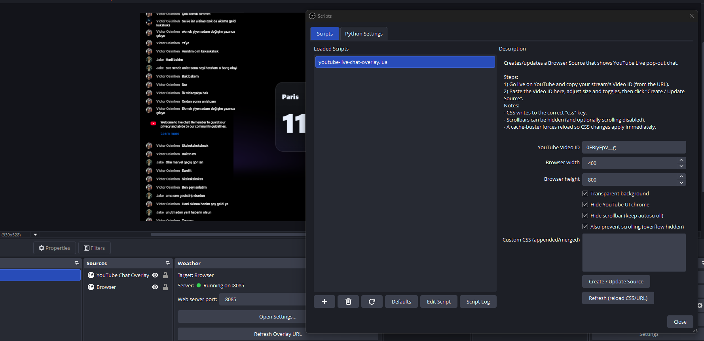

# 🎬 OBS YouTube Chat Overlay (Lua Script)

> A lightweight **OBS Studio Lua script** that automatically embeds your **YouTube Live Chat** as a clean, customizable Browser Source — no third-party overlays needed.

---

## ✨ Features

✅ Creates or updates a Browser Source named **“YouTube Chat Overlay”**  
✅ Automatically loads your YouTube **pop-out chat** using your live Video ID  
✅ **Transparent background** for seamless stream overlays  
✅ Option to **hide YouTube’s UI chrome** (header, input box, etc.)  
✅ Option to **hide scrollbars** or lock scrolling entirely  
✅ **Custom CSS** field to restyle chat freely  
✅ **Cache-buster refresh** so CSS updates apply instantly  
✅ No external dependencies — pure Lua, works inside OBS

---

## 🧩 How It Works

YouTube’s live chat can be embedded via the pop-out URL format:

```
https://www.youtube.com/live_chat?is_popout=1&v=VIDEO_ID
```

This script creates or updates an OBS **Browser Source** with that URL, using your provided Video ID.  
You can style it with your own CSS or keep the defaults for a clean, minimalist overlay.

---

## 🪄 Setup

### 1. Copy the Script

Save the file as **`youtube-chat-overlay.lua`** inside your OBS scripts folder.

### 2. Load It in OBS

- Go to **Tools → Scripts**
- Click **`+`** and select the `.lua` file

### 3. Configure Settings

- Enter your **YouTube Video ID** (the part after `v=` in your live URL)
- Adjust **Width** and **Height**
- Toggle:
  - 🟩 Transparent Background
  - 🟩 Hide YouTube UI Chrome
  - 🟩 Hide Scrollbar / Lock Scrolling
- (Optional) Add extra CSS styling in the “Custom CSS” field

### 4. Click **Create / Update Source**

The script automatically creates (or updates) a Browser Source called  
**“YouTube Chat Overlay”** in your current scene.

### 5. Done 🎉

Your live YouTube chat now appears directly in OBS — perfectly styled for your stream.

---

## 🎨 Default Styling

By default, the script applies a minimal CSS theme:

```css
html,
body {
  background: transparent !important;
}

yt-live-chat-header-renderer,
#header,
#panel-pages,
yt-live-chat-message-input-renderer {
  display: none !important;
}

/* Hide scrollbars but keep autoscrolling */
* {
  scrollbar-width: none !important;
}
*::-webkit-scrollbar {
  width: 0 !important;
  height: 0 !important;
}
*::-webkit-scrollbar-thumb {
  background: transparent !important;
}
```

You can easily override or extend these styles via the **Custom CSS** field.

---

## 🧠 Tips

- You can refresh the chat anytime by pressing the **“Refresh”** button.
- Use the “Cache-buster” built-in behavior to ensure changes reload properly.
- For advanced users:  
  Combine this with a small helper script that auto-writes your current live `VIDEO_ID` to a file if you stream frequently.

---

## 📸 Preview

_(Add your own screenshot of the chat overlay here)_  
Example with transparent background and scrollbars hidden:



---

## 🧰 Technical Notes

- Language: **Lua (OBS Scripting API)**
- Works on: **Windows, macOS, Linux**
- Requires: **OBS Studio 27+**
- Creates/updates Browser Sources using `obs_source_create` and `obs_source_update`
- Uses correct key `"css"` for injecting custom styling

---

---

## ☕ Support

If this script helps your stream, you can support development on Ko‑fi:  
**➡️ [Buy me a coffee](https://ko-fi.com/mmltech)**

You’ll help fund testing on Windows, macOS, and Linux and future features like auto‑detecting the live Video ID.

## 💖 Credits

Developed and maintained by **Marco Maxim**  
Part of the open-source ecosystem around streaming tools like **[OBSWeather](https://obsweather.com)** and **[OBSCountdown](https://obscountdown.com)**

---

### 🧾 License

MIT License © 2025 — You are free to modify and share as long as attribution is preserved.

---

### 📎 Related Projects

- ☕ **Ko‑fi** — Support development: **[ko-fi](https://ko-fi.com/mmltech)**

- 🌦 [OBS Weather Plugin](https://obsweather.com) - Live weather overlays for OBS
- ⏱ [OBS Countdown Widget](https://obscountdown.com) - Beautiful countdowns for streams
- 💬 [Free Streamers Promo](https://www.facebook.com/groups/freestreamerspromotion) - Community for streamers sharing growth tools
